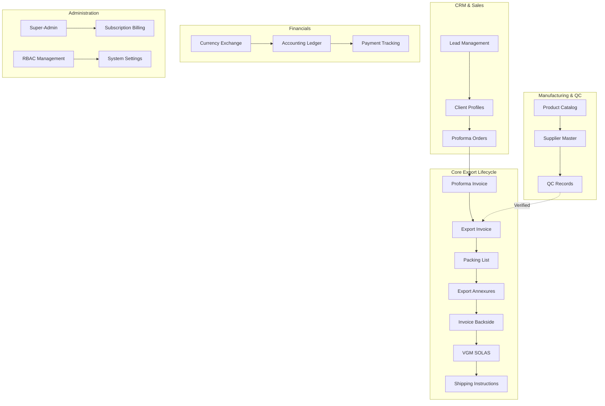
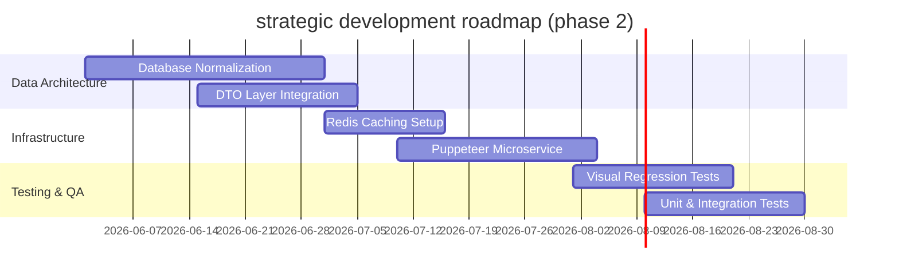

# ENTERPRISE STRATEGY & ARCHITECTURAL DEEP-DIVE

## Tile Exporter SaaS Platform: Next-Gen B2B ERP for Ceramic & Sanitaryware Exporters

**Date:** May 2026  
**Document Ref:** TE-ERP-V4.0-AUDIT  
**Prepared For:** Executive Board, Investors, and Enterprise Stakeholders  
**Prepared By:** Senior Enterprise SaaS Consultant, ERP Product Architect & UI/UX Strategist

---

## EXECUTIVE SUMMARY

```
┌────────────────────────────────────────────────────────────────────────┐
│                        T I L E   E X P O R T E R                       │
│              End-to-End Export Lifecycle Management SaaS                │
│                                                                        │
│   ┌─────────────────────┐   ┌─────────────────────┐   ┌────────────┐   │
│   │   Morbi Ceramic     │ ──│  Dynamic Database   │ ──│  Linear    │   │
│   │   Industry Fit      │   │  Per Tenant (Pool)  │   │  Lock Flow │   │
│   └─────────────────────┘   └─────────────────────┘   └────────────┘   │
└────────────────────────────────────────────────────────────────────────┘
```

The **Tile Exporter SaaS Platform** is a specialized, multi-tenant B2B ERP designed to automate the highly regulated, documentation-heavy operations of ceramic tile, sanitaryware, and faucet exporters. Originating from key manufacturing clusters like Morbi, India, the system manages the complete export lifecycle from initial CRM lead generation through to final Shipping Instructions and SOLAS VGM compliance.

### Strategic Highlights:

1. **Vertical ERP Fit:** Deep integration of tiles-specific mathematics (SQM to box ratios, weight-based container optimization, and palletization limits) solves major operational bottlenecks that generic ERPs fail to address.
2. **SaaS Multi-Tenancy:** Engineered with a secure, high-performance **database-per-tenant architecture** that prevents tenant data contamination and supports isolated database scaling.
3. **Regulatory Bulletproofing:** A strict 1-to-1 linear document locking workflow ensures that once a downstream document is generated, parent data is locked, eliminating document revision discrepancy and compliance penalties.

---

## 1. STRATEGIC BUSINESS VALUE PROPOSITION

Exporters face massive regulatory risk, logistics coordination costs, and cash flow bottlenecks. The platform addresses these challenges through three core value pillars:

### Financial & Operational Value Driver Table

| Challenge Area                  | Legacy / Manual Process Impact                                                                                                                  | Tile Exporter Platform Solution                                                                                                                      | Direct ROI Metric                                     |
| :------------------------------ | :---------------------------------------------------------------------------------------------------------------------------------------------- | :--------------------------------------------------------------------------------------------------------------------------------------------------- | :---------------------------------------------------- |
| **Regulatory Fines**            | Typographical errors in Shipping Bills, Bill of Ladings, or VGM documents lead to customs holds and high port demurrage fees ($500+/day).       | **Automated Data Inheritance Chain**: Data flows from Proforma Invoice to Export Invoice and Packing List without manual re-entry.                   | **0%** data entry discrepancies in customs filings.   |
| **Morbi Supplier Coordination** | Exporting tiles requires coordinating with 5-10 third-party factories. Incorrect box markings, pallet types, or weights cause loading failures. | **Supplier & Pallet Master Integration**: Automates calculations for gross/net weights, custom pallet styles, and tracks factory-origin allocations. | **15-20%** reduction in warehouse loading delays.     |
| **Document Synchronization**    | A minor weight change on the commercial invoice requires manual changes across 5 other documents. Missed updates cause customs rejection.       | **Active Downstream Synchronization**: Syncs critical updates (e.g. weight, box counts) dynamically from parent invoices to VGM and Packing Lists.   | **90%** reduction in manual document amendment times. |
| **Multi-Tenant Data Privacy**   | Multi-company shared databases risk accidental leakage of client pricing, supplier relationships, and margin structures.                        | **Physical Database-Per-Tenant Isolation**: Programmatic connection routing at API gateway level prevents database crossovers.                       | **Zero Risk** of cross-tenant data leakage.           |

---

## 2. FUNCTIONAL PRODUCT ARCHITECTURE

The platform comprises **22 functional modules** covering every phase of the export lifecycle.



### Module Breakdown:

- **CRM & Client Hub:** Leads management, client directory, salesperson assignments, credit limits, and credit days.
- **Product Catalog (Tiles & Sanitaryware):** Dedicated masters managing tiles specs (size, thickness, surface, coverage) and sanitaryware specs.
- **Core Logistics Engine:** Governs the generation of 6 distinct export documents (Export Invoice, Packing List, Annexures I & II, Invoice Backside, Verified Gross Mass (VGM), Shipping Instructions).
- **Double-Entry Ledger:** Tracks cash flows, payment entries, accounts receivable, and supports multiple currencies with exchange rate mapping.
- **Super-Admin & Subscription:** Plan management, tenant onboarding, DB provisioning logs, and feature flag controls.

---

## 3. CORE EXPORT LIFE CYCLE & DOCUMENT LOCK PIPELINE

To guarantee document integrity and regulatory compliance, the platform enforces a **Strict 1-to-1 Linear Downstream Document Lock**.

```
┌─────────────────────────────────┐
│     Proforma Invoice (PI)       │  [Initial agreement with importer]
└─────────────────────────────────┘
                 │
                 ▼
┌─────────────────────────────────┐
│       Export Invoice (EI)       │  [Final commercial invoice, triggers lock on PI]
└─────────────────────────────────┘
                 │
                 ▼
┌─────────────────────────────────┐
│        Packing List (PL)        │  [Assigned boxes & weights, triggers lock on EI]
└─────────────────────────────────┘
                 │
                 ▼
┌─────────────────────────────────┐
│     Export Annexure (ANX)       │  [Morbi customs loading details, locks PL]
└─────────────────────────────────┘
                 │
                 ▼
┌─────────────────────────────────┐
│      Invoice Backside (IB)      │  [Container seal & carriage details, locks ANX]
└─────────────────────────────────┘
                 │
                 ▼
┌─────────────────────────────────┐
│    Verified Gross Mass (VGM)    │  [SOLAS container weight compliance, locks IB]
└─────────────────────────────────┘
                 │
                 ▼
┌─────────────────────────────────┐
│    Shipping Instructions (SI)   │  [Final freight forwarder bill of lading instructions]
└─────────────────────────────────┘
```

### Document Lock Rules & Relational Sync:

- **Transactional State Integrity:** Upon creation of a downstream document, the controller sets the parent document's state flags (`is_used = true`, `is_converted = true`, `status = 'Converted'`). This prevents duplicate generations.
- **Data Inheritance Bridge:** Fields like `client_name`, `gross_weight`, `net_weight`, and `port_of_loading` are inherited automatically. The system uses a dedicated frontend hook `useExportWorkflow` and backend `exportWorkflowInterconnectionService` to map data seamlessly.
- **Triple-Layer Regulatory Fallback:** Important regulatory values (such as `IEC_NO`, `LUT_ARN`, and `PERMISSION_NO`) use a lookup fallback hierarchy:
  1. **Transaction Level:** Override value directly written in the active document.
  2. **Lifecycle Level:** Inherited from the root Export Invoice.
  3. **Master Level:** Fetched dynamically from the Company settings table if not provided elsewhere.

---

## 4. MATHEMATICAL CALCULATION ENGINE & ERP LOGIC

Export shipping is constrained by weight limits (usually ~27-28 Metric Tons per 20ft container) rather than volume. Accurate box-to-weight conversions are critical.

### 1. Tile Packaging Aggregation Formula

When calculating cargo distribution, the system aggregates parameters using product characteristics:

$$\text{Total Boxes} = \sum (\text{Container Boxes})$$

$$\text{Total SQM} = \sum (\text{Boxes} \times \text{Sqm Per Box})$$

$$\text{Net Weight (kg)} = \sum (\text{Boxes} \times \text{Box Weight})$$

$$\text{Gross Weight (kg)} = \text{Net Weight} + (\text{Total Pallets} \times 20\,\text{kg})$$

_(Note: Pallet weight is standardized globally at 20kg per wooden pallet for freight calculations)._

### 2. Double-Entry Accounting Ledger Logic

Whenever a payments or invoicing activity occurs, the ledger automatically registers corresponding debit/credit flows:

$$\text{FOB Total} = \text{Taxable Subtotal} + \text{Taxes (SGST + CGST + IGST)} + \text{Handling Charges}$$

$$\text{CIF Total} = \text{FOB Total} + \text{Shipping Cost (Freight)} + \text{Insurance}$$

#### Journal Postings on Commercial Invoice Finalization:

- **Debit:** Accounts Receivable (Asset Account) $\rightarrow$ Increase
- **Credit:** Export Sales Revenue (Revenue Account) $\rightarrow$ Increase

#### Journal Postings on Payment Receipt:

- **Debit:** Bank/Cash Account (Asset Account) $\rightarrow$ Increase
- **Credit:** Accounts Receivable (Asset Account) $\rightarrow$ Decrease

---

## 5. TECHNICAL ARCHITECTURE & MULTI-TENANCY

The system employs a **Database-per-Tenant model** utilizing PostgreSQL schema isolation. This architecture provides maximum security and operational flexibility.

```
                  ┌──────────────────────┐
                  │   HTTP REST Request  │
                  └──────────────────────┘
                              │
                              ▼
                  ┌──────────────────────┐
                  │    JWT Auth Guard    │
                  └──────────────────────┘
                              │ [Resolves Company ID]
                              ▼
                  ┌──────────────────────┐
                  │  dbRouter Middleware │
                  └──────────────────────┘
                              │
           ┌──────────────────┼──────────────────┐
           ▼                  ▼                  ▼
┌────────────────────┐ ┌───────────────┐ ┌───────────────┐
│    Master DB       │ │ Tenant DB 1   │ │ Tenant DB 2   │
│ tile_exporter_crm  │ │ company_alpha │ │ company_beta  │
└────────────────────┘ └───────────────┘ └───────────────┘
```

### Key Technical Mechanisms:

#### 1. Dynamic DB Router Middleware

The `dbRouter.js` middleware interceptor checks the tenant identifier decoded from the client's JWT token (`req.user.companyId`) and selects the appropriate connection pool dynamically:

```javascript
// backend/src/middleware/dbRouter.js
export const dbRouter = async (req, res, next) => {
  try {
    const companyId = req.headers["x-company-id"] || req.user?.companyId;

    if (!companyId && req.user?.role !== "super_admin") {
      return res.status(400).json({ error: "Company context required" });
    }

    if (companyId) {
      req.db = await getCompanyDB(companyId); // Retrieves isolated connection pool
      req.companyFilter = companyId;
    } else {
      req.db = masterPool; // Global administration pool
      req.companyFilter = null;
    }
    next();
  } catch (error) {
    res.status(500).json({ error: "Database routing failed" });
  }
};
```

#### 2. Programmatic Schema Synchronization (`check_db.js`)

On boot or new tenant provisioning, a self-healing schema synchronization utility inspects all active tenant database schemas, appending workflow-tracking columns dynamically:

- Inspects tables: `proforma_invoices`, `export_invoices`, `packing_lists`, `vgm_documents`, etc.
- Checks columns: `is_used`, `is_converted`, `linked_document_id`, `document_status`.
- Appends columns programmatically using SQL DDL instructions if they are missing.

---

## 6. SECURITY & ACCESS CONTROL (RBAC)

The system features multi-tiered security built on JWT credentials and granular role mappings.

```
┌─────────────────────────────────────────────────────────────┐
│                   ROLE PERMISSION MAP                       │
│                                                             │
│  [Super-Admin / Company Admin] ────────► All Operations     │
│                                                             │
│  [Sales Manager / Account / Admin] ────► packing-list, vgm  │
│                                                             │
│  [Sales Executive] ────────────────────► CRM & Leads Only   │
└─────────────────────────────────────────────────────────────┘
```

### Security Audit Findings:

1. **Stealth 404 Guard:** If a regular tenant user attempts to bypass boundaries via header manipulation (`x-company-id` or query parameters) to access another company's records, the system responds with a stealthy **404 Not Found** instead of a _403 Forbidden_. This prevents bad actors from scanning the system for valid tenant IDs.
2. **Frontend Permissions Gateway (`rolePermissions.js`):** Restricts interface views dynamically. For example:
   - **Sales Executives** are completely blocked from viewing financial accounting entry modules.
   - **Supplier Management** displays only if the parent subscription allows the Proforma Order module.
3. **Audit Trail Compliance:** The system maintains an `audit_logs` table recording the action, user, timestamp, resource ID, IP address, and JSON diffs of changes, meeting international compliance requirements.

---

## 7. SYSTEM GAP ANALYSIS & ARCHITECTURAL ISSUES

While highly functional, the current system has several gaps that present performance and maintenance risks at scale.

### 1. Database Denormalization (JSONB Payload Bloat)

- **The Gap:** Transactional documents (e.g. `export_invoices`, `export_invoice_annexures`) store line items (`product_lines` and `container_details`) as a `JSONB` array within the invoice row instead of using relational junction tables.
- **The Risk:**
  1. Prevents database-level aggregations (e.g., querying total sqm of "60x60 Glazed Vitrified Tiles" exported to Saudi Arabia requires parsing nested JSON on every row).
  2. Increases row read size and memory overhead.
  3. Risk of data drift if product names or prices change in the catalog.

### 2. Global State & Form Prop-Drilling

- **The Gap:** Complex nested forms (such as `ExportInvoiceForm` and its children) rely heavily on React prop-drilling to propagate changes down the hierarchy.
- **The Risk:** Unnecessary component re-renders, complex state synchronization bugs, and difficult-to-maintain form code.

### 3. Client-Side Browser Printing Vulnerabilities

- **The Gap:** Document layouts (commercial invoices, packing lists, VGM sheets) use native browser print engines (`@media print` styles) directly from the client.
- **The Risk:** Output layout depends on the client browser (Chrome vs Safari vs Firefox) and local printer configurations. This can cause unexpected margin shifts, scaling issues, or multi-page alignment breaks.

---

## 8. STRATEGIC DEVELOPMENT ROADMAP (PHASE 2)

We recommend a structured Phase 2 plan to address technical gaps and transition the ERP into an enterprise-scale global B2B platform.



### 1. Database Normalization (Target: Q3 2026)

- Create dedicated relational tables for `invoice_items` and `container_items`.
- Keep the JSONB column only as a historical snapshot for audited document locking.

### 2. Headless PDF Microservice (Target: Q3 2026)

- Deploy a backend headless browser (Puppeteer) or a dedicated PDF generator (e.g., `pdfmake`).
- Generate PDFs on the server side to guarantee pixel-perfect document rendering across all platforms.

### 3. Automated Testing & Visual Regression (Target: Q4 2026)

- Implement automated visual testing (e.g., using Percy or Playwright) to verify that print templates remain aligned after changes.
- Add unit testing for weight and packaging aggregation calculations.

---

## 9. ENTERPRISE AI & AUTOMATION ROADMAP

AI integration offers significant opportunities to automate data entry, improve compliance, and optimize logistics.

```
┌─────────────────────────────────────────────────────────────┐
│                     AI CAPABILITIES                         │
│                                                             │
│  [Current State]  ──► GPT-4 Document Insights & ERP Chat    │
│                                                             │
│  [Proposed AI]   ──► OCR Document Processing               │
│                   ──► Intelligent HS Code Mapping           │
│                   ──► Predictive Vessel Delay Forecasting   │
└─────────────────────────────────────────────────────────────┘
```

### 1. Current AI Implementation

- **Document Insights:** Utilizes GPT-4 to analyze invoices and QC records, returning detailed business summaries.
- **Implementation Consultant Chat:** An interactive assistant that helps users configure the ERP and navigate export workflows.

### 2. Proposed AI Capabilities

- **OCR Shipping Document Ingestion:** Scan and extract data from external Bills of Lading, custom clearance certificates, and supplier packing slips to automate entry.
- **Intelligent HS Code Mapping:** Suggests appropriate Harmonized System (HS) codes based on product category, surface type, and chemical properties (e.g. ceramic vs porcelain tile classification).
- **Predictive Vessel Delay Logging:** Analyzes historical shipping route data to forecast potential port delays and shipping time variance, allowing exporters to manage client expectations proactively.

---

## APPENDIX: COMPLIANCE CHECKLIST

Prior to global multi-tenant launch, the following checklist must be satisfied:

- [x] **Tenant Database Provisioning:** Verified programmatically via automated DB provisioning script.
- [x] **Stealth 404 Enforcement:** Tested header boundary bypass attempts.
- [x] **A4 WYSIWYG Standard:** Verified native print preview dimensions constraints (A4 layout).
- [ ] **ACID Database Transactions:** Ensure multi-row inserts (order lines) use SQL transactions.
- [ ] **Relational Database Normalization:** Transition line items out of JSONB array structures.
- [ ] **Automated Testing Coverage:** Implement unit testing for core volume/weight calculations.
