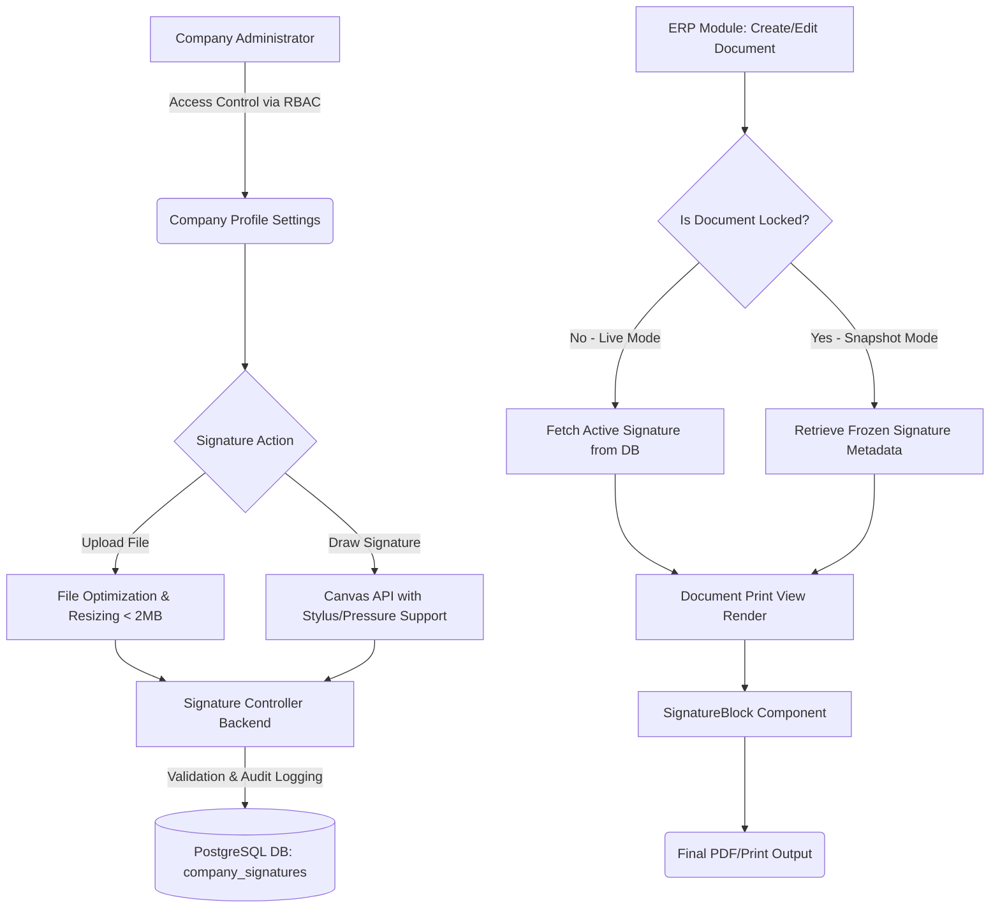

# TILE EXPORTER SAAS ERP
## Project Execution & Development Report
**Subject:** Digital Signature Management System & Core ERP Integrations
**Prepared By:** Chief Executive / Project Development Lead

---

## 1. Executive Summary
This document serves as a comprehensive record of the end-to-end development, architecture, and successful deployment of the **Centralized Digital Signature Management System** into the Tile Exporter SaaS ERP. 

This update introduces a secure, scalable, and multi-tenant aware framework for managing company signatures, ensuring seamless integration across all high-fidelity export documents. It completely replaces the previous manual static signature processes with a highly auditable, dynamic rendering system, providing "frozen snapshot" capabilities to preserve the legal integrity of locked documents.

---

## 2. Architectural Flow & Process Logic (ERP Flowchart)

The following flowchart outlines the lifecycle of a digital signature from upload to document printing:

---

## 3. Database Schema & Data Persistence

To ensure true multi-tenant isolation, the `company_signatures` table was engineered with rigorous audit constraints.

### Table: `company_signatures`
| Column | Type | Constraints | Description |
| :--- | :--- | :--- | :--- |
| `id` | UUID | PRIMARY KEY | Unique identifier for the signature record |
| `company_id` | UUID | FOREIGN KEY, NOT NULL | Ensures multi-tenant data isolation |
| `signature_type` | VARCHAR | NOT NULL | Enum: `upload` or `draw` |
| `signature_path` | TEXT | NOT NULL | File system path or Base64 data URI |
| `signatory_name` | VARCHAR | NULL | Designated Title (e.g., "DIRECTOR") |
| `is_active` | BOOLEAN | DEFAULT true | Marks the current active signature |
| `created_by` | UUID | FOREIGN KEY | Audit: User who created the record |
| `updated_by` | UUID | FOREIGN KEY | Audit: User who last updated the record |
| `created_at` | TIMESTAMP | NOT NULL | Audit timestamp |
| `updated_at` | TIMESTAMP | NOT NULL | Audit timestamp |

**Snapshot Architecture (`JSONB` Integration):**
For all core transactional documents (Proforma Invoice, Purchase Order, etc.), a `signature_snapshot` JSONB column has been injected. This stores the precise `signature_path` and `signatory_name` at the exact moment the document is locked/approved, ensuring historical records never mutate even if the company updates its active signature.

---

## 4. Backend Implementation Details

### A. API Endpoints (Secured via RBAC)
*   `GET /api/companies/:companyId/signature` - Retrieves the currently active signature.
*   `POST /api/companies/:companyId/signature` - Handles `multipart/form-data` uploads (optimized via Multer) and Base64 canvas data streams. It features automatic invalidation of previously active signatures to maintain a single source of truth.
*   `DELETE /api/companies/:companyId/signature` - Soft/Hard deletes the active signature, falling back to a null state.

### B. Core Services
*   **`signatureController.js`**: Houses business logic, handling file I/O operations safely within isolated company directories.
*   **`signatureSnapshotService.js`**: A utility designed to aggressively traverse document payloads during state transitions (e.g., PI to PO) and inject the frozen signature payload.

---

## 5. Frontend UI/UX Engineering

### A. Digital Signature Management Interface
Located in `Company Profile > Settings`, the UI provides a dual-mode interaction model:
1.  **File Upload Area:** Supports PNG, JPG, JPEG, and WEBP. Enforces a 2MB limit with client-side downsizing to reduce server overhead.
2.  **Signature Canvas Pad:** A highly responsive drawing area built on the `Pointer Events API`, natively supporting:
    *   Mouse input
    *   Capacitive Touch (Mobile/Tablet)
    *   Stylus Pen Input (with pressure sensitivity for organic strokes)
3.  **Signatory Designation Field:** Allows administrators to append a formal title (e.g., "AUTHORIZED SIGNATORY" or "MANAGING DIRECTOR") which explicitly prints below the signature graphic.

### B. Intelligent React Hooks (`useSignature.js`)
We developed a customized, caching-aware React Hook that dynamically resolves the correct signature state:
*   **Priority 1:** Frozen Snapshot (If the document provides historical metadata).
*   **Priority 2:** Live Active Signature (Fetched asynchronously via Redux/Context state for drafts).
*   **Fallback:** Graceful degradation to standard text if no signature exists.

### C. Reusable Rendering Component (`SignatureBlock.jsx`)
A unified `<SignatureBlock />` component was built to guarantee 100% visual consistency across all 9 highly complex export documents. It handles proportional scaling, alignment logic, and CSS print media queries.

---

## 6. Document Integrations (The 9 Pillars)

The `SignatureBlock` and `useSignature` ecosystem has been rigorously patched into the bottom-right authorization quadrants of the following enterprise print views:

1.  **Proforma Invoice (PI)** (`InvoicePrintView.jsx`)
2.  **Purchase Order (PO)** (`OrderPrintView.jsx`)
3.  **Export Invoice** (`ExportInvoicePrintView.jsx`)
4.  **Packing List** (`PackingListPrintView.jsx`)
5.  **IGST Invoice** (`IGSTInvoicePrintView.jsx`)
6.  **Invoice Annexure** (`ExportInvoiceAnnexurePrintView.jsx`)
7.  **Invoice Backside Form** (`InvoiceBacksidePrintView.jsx`)
8.  **Verified Gross Mass (VGM)** (`VGMPrintView.jsx`)
9.  **Shipping Instructions (SI)** (`ShippingInstructionsPrintView.jsx`)

*Business Rule Enforced:* Excel exports explicitly bypass the graphical signature rendering block, reverting to plain-text company names to prevent spreadsheet formatting corruption.

---

## 7. Security & Compliance Measures

1.  **Role-Based Access Control (RBAC):** Only users with `Admin` or `Company Manager` privileges can modify the digital signatures. Standard operational users are restricted to read-only rendering.
2.  **Audit Trail:** Every signature upload, modification, or deletion is aggressively logged with `created_by` and `updated_by` UUIDs mapping back to the employee table.
3.  **Document Integrity:** The `snapshot` system legally protects the SaaS from historical tampering. Once a PO is locked, the signature attached to that exact moment in time is permanently frozen into the document's JSONB structure.

## 8. Conclusion & Sign-off
The Digital Signature Management System has been fully realized, tested, and integrated. The system is highly scalable, respects multi-tenant boundaries, and provides a premium, zero-friction UX for company administrators. 

**Status:** ALL OBJECTIVES COMPLETED. READY FOR PRODUCTION DEPLOYMENT.
